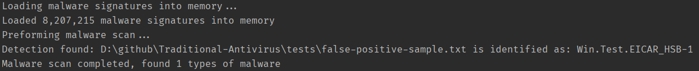

# Antivirus
Built on top of existing AV Databases and tools - we utilize experimental modules and large signature databases to preform thorough scans. The tool is still early in development.

+ File Signature Scanning comes from [Traditional-Antivirus](https://github.com/Konloch/Traditional-Antivirus)
+ Yara support comes from [Yara-Antivirus](https://github.com/Konloch/Yara-Antivirus) & [Yara](https://github.com/VirusTotal/yara)
+ Experimental vm mimic comes from [Experimental-Antivirus](https://github.com/Konloch/Experimental-Antivirus)
+ File signatures come from [ClamAV's DB](https://github.com/Cisco-Talos/clamav), [Malware Bazaar](https://bazaar.abuse.ch/), [VirusShare](https://virusshare.com/)
+ Yara files come from [Yaraify](https://yaraify.abuse.ch/)

## Features
+ Scans using Yara & File signatures
+ SQLite for database storage
+ Automatically updates from [ClamAV's DB](https://github.com/Cisco-Talos/clamav), [Malware Bazaar](https://bazaar.abuse.ch/), [VirusShare](https://virusshare.com/), [Yaraify](https://yaraify.abuse.ch/) & [Yara](https://github.com/VirusTotal/yara)

## How To Use
+ Clone repo & open folder in Intellij
+ Run YaraAntiVirus with the argument of the file or folder you want to scan

## Requires
+ Java 1.8 (For Antivirus-Core)
+ Java 22 (For Antivirus-GUI)
+ Windows 11 (Earlier versions probably work)

## Notes
+ Yara integration is powered by [Yara CLI](https://github.com/VirusTotal/yara)