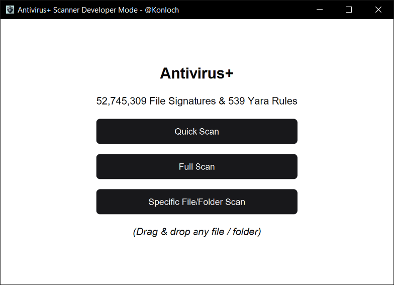
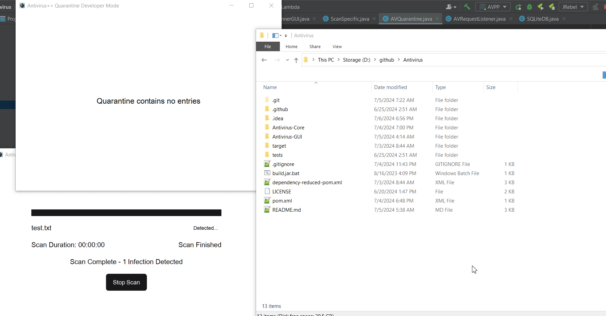
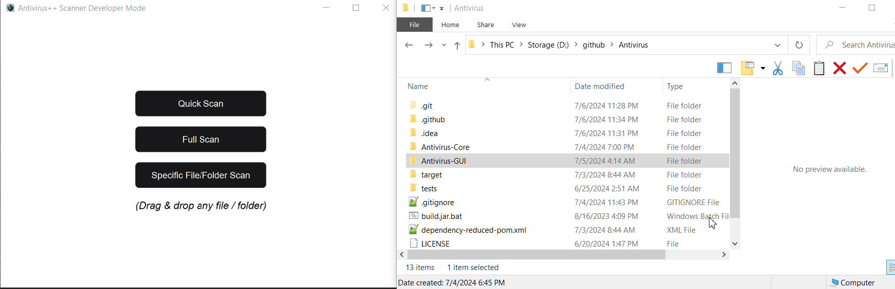

# Antivirus+

## General Features
+ Mixes both static and dynamic file scanning
+ Built on top of existing AV databases & tools
+ Experimental modules
+ Large signature database
+ The tool is still early in development

## Technical Features
+ Scans using Yara & File signatures
+ SQLite for database storage
+ Automatically updates from [ClamAV's DB](https://github.com/Cisco-Talos/clamav), [Malware Bazaar](https://bazaar.abuse.ch/), [VirusShare](https://virusshare.com/), [Yaraify](https://yaraify.abuse.ch/) & [Yara](https://github.com/VirusTotal/yara)
  + You need to manually update AV+ itself though, the software will not self-update, only the signatures and scanning dependencies.

## How To Use
+ Install the [latest JRE](https://adoptium.net/temurin/releases/?version=22) (22 or higher)
+ Download the [latest release](https://github.com/Konloch/Antivirus/releases/latest)
+ Run the jar file
+ Report all issues [here](https://github.com/Konloch/Antivirus/issues/new)

## Requires
+ Java 1.8 (For Antivirus-Core)
+ Java 22 (For Antivirus-GUI)
+ Windows 11 (Earlier versions also work)
  + Linux / Mac support technically works (to an extent) but due to lack of demand it's not directly supported
  + If you have the need for Mac / Linux usage open an issue and let us know

## Credits
+ File Signature Scanning comes from [Traditional-Antivirus](https://github.com/Konloch/Traditional-Antivirus)
    + File signatures database come from [ClamAV's DB](https://github.com/Cisco-Talos/clamav), [Malware Bazaar](https://bazaar.abuse.ch/), [VirusShare](https://virusshare.com/)
+ Yara Scanning comes from [Yara-Antivirus](https://github.com/Konloch/Yara-Antivirus) & [Yara](https://github.com/VirusTotal/yara)
    + Yara database come from [Yaraify](https://yaraify.abuse.ch/)
+ Experimental vm mimic comes from [Experimental-Antivirus](https://github.com/Konloch/Experimental-Antivirus) & [Fake-Sandbox-Artifacts](https://github.com/NavyTitanium/Fake-Sandbox-Artifacts)

## Notes
+ Yara integration is powered by [Yara CLI](https://github.com/VirusTotal/yara)
+ *Quarantine does not actually quarantine* - Until we can rule out false positives from the yara rules we probably won't have a realtime quarantine.
  + Instead, we have a passive quarantine that requires the user to decide if they want to remove the files or not.

## More Media

