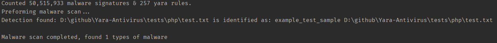

# Antivirus+

## General Features
+ Mixes both static and dynamic file scanning
+ Built on top of existing AV databases & tools
+ Experimental modules
+ Large signature database
+ The tool is still early in development

## Technical Features
+ Scans using Yara & File signatures
+ SQLite for database storage
+ Automatically updates from [ClamAV's DB](https://github.com/Cisco-Talos/clamav), [Malware Bazaar](https://bazaar.abuse.ch/), [VirusShare](https://virusshare.com/), [Yaraify](https://yaraify.abuse.ch/) & [Yara](https://github.com/VirusTotal/yara)
  + *You need to manually update AV+ itself though, the software will not self-update, only the signatures and scanning dependencies*

## How To Install
+ Install the [latest JRE](https://adoptium.net/temurin/releases/) (Must be on Java 8 or higher)
+ Download the [latest release](https://github.com/Konloch/Antivirus/releases/latest)
+ Run the latest release
  + *You'll have to wait for the initial download to finish before you can scan*
  + *Due to the signature database size this can be up to an hour*
+ Report all issues [here](https://github.com/Konloch/Antivirus/issues/new)

## How To Use
+ Use the tray to access the various GUIs
  + Scanner
  + Settings
  + Quarantine

## How To Scan
+ Drag and drop any folder or file you want to scan
+ Full scan will scan all of your drives and files, this requires admin elevated rights for a deep scan but works without it
+ Quick scan will scan all start-up locations & other well known locations
+ Specific scan will prompt a file selection dialogue - select any file or folder from here

## How To Remove Detections
+ Open the quarantine from the tray
+ Review the file-paths by hovering over the file-name to verify the file isn't a false positive

## Requires
+ Java 8 (Later versions also work)
+ Windows 11 (Earlier versions also work)
  + Linux / Mac support works but has limited feature set
    + *Experimental VM Mimic is currently windows only*

## Credits
+ File Signature Scanning comes from [Traditional-Antivirus](https://github.com/Konloch/Traditional-Antivirus)
    + File signatures database come from [ClamAV's DB](https://github.com/Cisco-Talos/clamav), [Malware Bazaar](https://bazaar.abuse.ch/), [VirusShare](https://virusshare.com/)
+ Yara Scanning comes from [Yara-Antivirus](https://github.com/Konloch/Yara-Antivirus)
  + Yara integration is powered by [Yara CLI](https://github.com/VirusTotal/yara)
  + Yara database come from [Yaraify](https://yaraify.abuse.ch/)
+ Experimental VM Mimic comes from [Experimental-Antivirus](https://github.com/Konloch/Experimental-Antivirus)
  + Experimental VM Mimic process names [Fake-Sandbox-Artifacts](https://github.com/NavyTitanium/Fake-Sandbox-Artifacts)

## Notes
+ **Use in combination with Windows Defender or another trusted Antivirus**
+ **Quarantine does not actually quarantine** - Until we can rule out false positives from the yara rules we probably won't have a realtime quarantine
  + Instead, we have a passive quarantine that requires the user to decide if they want to remove the files or not

## More Media

Scanning GUI with Quarantine GUI

Scanning GUI

Settings GUI

Startup after fully installed

Downloading dependencies announcements

Tray navigation
